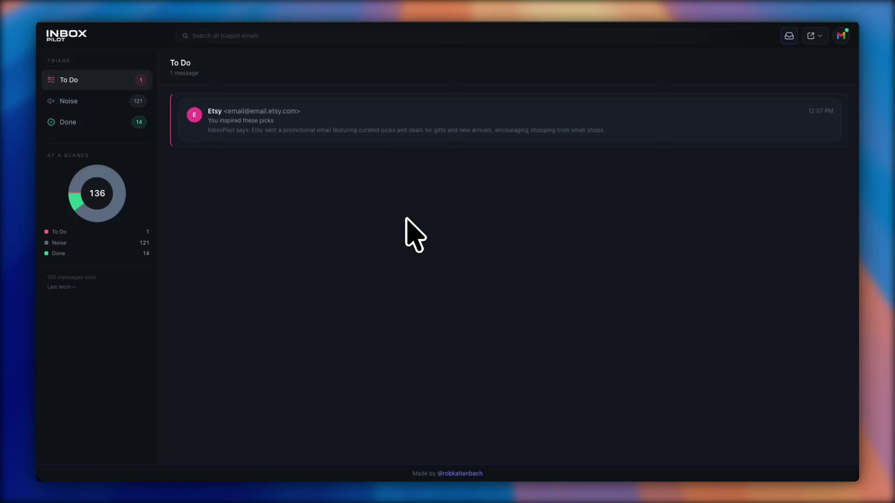
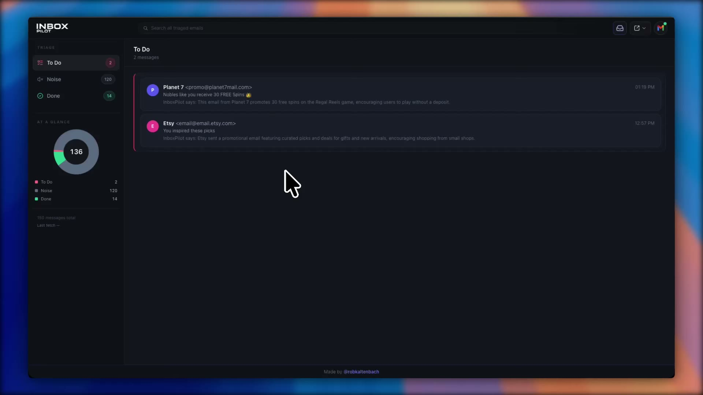
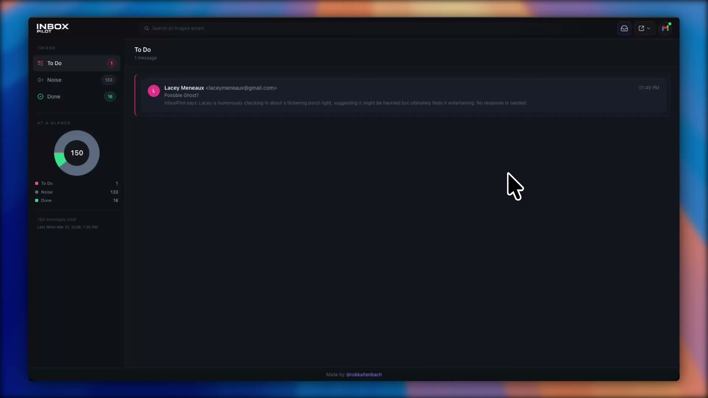
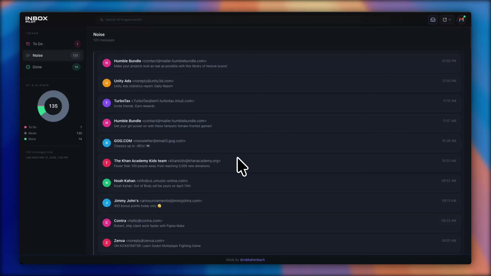
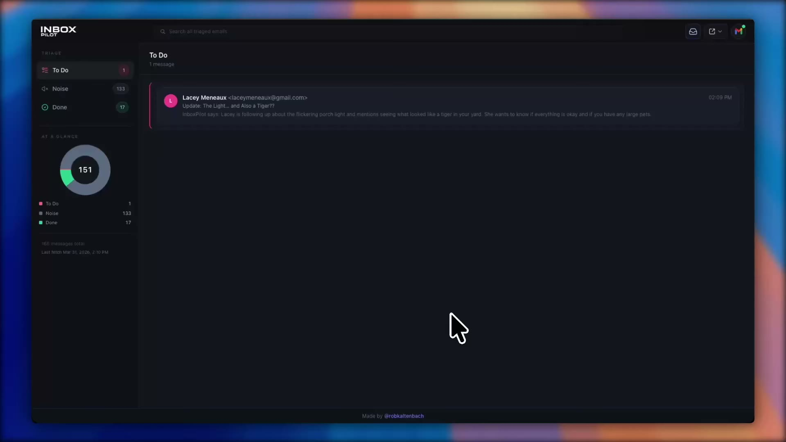
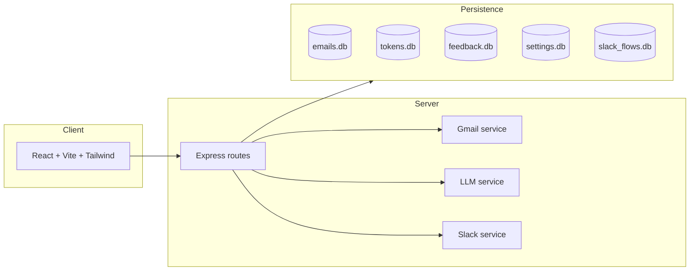

# InboxPilot

AI-powered Gmail triage assistant built for fast decision-making: classify unread email into actionable lanes, generate reply drafts, and optionally run a Slack-first workflow for triage/reply/completion.

## Product demo video

Paste your demo link here:

- YouTube: `https://www.youtube.com/watch?v=YOUR_VIDEO_ID`

Or use this embed snippet (replace `YOUR_VIDEO_ID`):

```html
<p align="center">
  <iframe
    width="900"
    height="506"
    src="https://www.youtube.com/embed/YOUR_VIDEO_ID"
    title="InboxPilot demo"
    frameborder="0"
    allow="accelerometer; autoplay; clipboard-write; encrypted-media; gyroscope; picture-in-picture; web-share"
    allowfullscreen
  ></iframe>
</p>
```

## Feature tour

Short clips in a two-column layout (media / text, alternating). Assets live in [`docs/demo/`](./docs/demo/).

**Note:** GitHub’s README renderer does **not** reliably show `<video>` embeds (they are often stripped). Each row uses a **poster image** that links to the **raw WebM** so your browser can play or download it. Links that point at the normal file page (`/blob/…`) hit GitHub’s preview UI, which often refuses WebM even for small files — use **Open clip (raw WebM)** below. (Forks: replace `robkaltenbach/inbox-pilot` in those URLs with your fork.)

<table>
<tr>
<td width="50%" valign="top">
  <a href="https://raw.githubusercontent.com/robkaltenbach/inbox-pilot/main/docs/demo/IP-AutoFetch.webm" title="Play WebM clip">
    
  </a>
  <p><a href="https://raw.githubusercontent.com/robkaltenbach/inbox-pilot/main/docs/demo/IP-AutoFetch.webm">Open clip (raw WebM)</a></p>
</td>
<td valign="top">
  <h3>Fetching mail (three paths)</h3>
  <p>How mail enters InboxPilot: <strong>Gmail push</strong> (Pub/Sub watch + webhook), <strong>manual fetch all</strong> from the header, and <strong>manual fetch on a single thread</strong> — so you can stay hands-off, batch, or drill into one conversation.</p>
</td>
</tr>
</table>

<table>
<tr>
<td valign="top">
  <h3>Human in the loop</h3>
  <p>Give the model <strong>pointers</strong> so it learns what counts as important vs noise for you — steering detection over time instead of a one-shot classifier.</p>
</td>
<td width="50%" valign="top">
  <a href="https://raw.githubusercontent.com/robkaltenbach/inbox-pilot/main/docs/demo/IP-HumanInTheLoop.webm" title="Play WebM clip">
    
  </a>
  <p><a href="https://raw.githubusercontent.com/robkaltenbach/inbox-pilot/main/docs/demo/IP-HumanInTheLoop.webm">Open clip (raw WebM)</a></p>
</td>
</tr>
</table>

<table>
<tr>
<td width="50%" valign="top">
  <a href="https://raw.githubusercontent.com/robkaltenbach/inbox-pilot/main/docs/demo/IP-Reply.webm" title="Play WebM clip">
    
  </a>
  <p><a href="https://raw.githubusercontent.com/robkaltenbach/inbox-pilot/main/docs/demo/IP-Reply.webm">Open clip (raw WebM)</a></p>
</td>
<td valign="top">
  <h3>Reply from the app</h3>
  <p><strong>Reply</strong> from the card, <strong>open the thread in Gmail</strong> when you want the full client, or <strong>use AI</strong> to generate or jump-start a response before you edit and send.</p>
</td>
</tr>
</table>

<table>
<tr>
<td valign="top">
  <h3>Search &amp; filtering</h3>
  <p><strong>Client-side filtering and search</strong> across triaged mail so you can find threads quickly without another round trip to the server.</p>
</td>
<td width="50%" valign="top">
  <a href="https://raw.githubusercontent.com/robkaltenbach/inbox-pilot/main/docs/demo/IP-Search.webm" title="Play WebM clip">
    
  </a>
  <p><a href="https://raw.githubusercontent.com/robkaltenbach/inbox-pilot/main/docs/demo/IP-Search.webm">Open clip (raw WebM)</a></p>
</td>
</tr>
</table>

<table>
<tr>
<td width="50%" valign="top">
  <a href="https://raw.githubusercontent.com/robkaltenbach/inbox-pilot/main/docs/demo/IP-Slack.webm" title="Play WebM clip">
    
  </a>
  <p><a href="https://raw.githubusercontent.com/robkaltenbach/inbox-pilot/main/docs/demo/IP-Slack.webm">Open clip (raw WebM)</a></p>
</td>
<td valign="top">
  <h3>Slack integration</h3>
  <p>Tune <strong>Slack notification rules</strong> from the app, then <strong>read the message</strong>, <strong>reply</strong> (including in thread), and <strong>complete</strong> work from the channel — without living in Gmail for every touch.</p>
</td>
</tr>
</table>

---

## Why this project exists

InboxPilot is meant to show practical product + engineering judgment:
- Build an end-to-end workflow around real APIs (Gmail + Slack), not just a model demo.
- Combine LLM output with deterministic guardrails and explicit user control.
- Keep architecture intentionally simple for fast iteration, while documenting a realistic scaling path.

## Product summary

- **To Do / Noise / Done lanes** for triage clarity.
- **LLM summaries + drafts** for `NEEDS_REPLY` messages.
- **Manual correction loop** (`inform`) to improve future classification context.
- **Thread-centric UI** (dedup by `thread_id`) so the dashboard tracks conversations, not raw message volume.
- **Slack integration** with interactive threaded flow:
  - Parent actions: `See message`, `Reply`, `Reply with AI`, `Complete`
  - Body shown in 500-char chunks via `Continue`
  - Reply capture from next user message in thread (Events API)
  - Complete marks the item done in app state
- **Gmail connection modal** in UI showing connected inbox state and explicit logout action.

## Quick walkthrough (3-5 minutes)

1. Connect Gmail from the top-right Gmail icon.
2. Click **Fetch & Triage**.
3. Open a **To Do** card:
   - show summary,
   - show generated draft,
   - explain `Send`, `Discard`, `Complete`.
4. Open **Outputs** and trigger **Send digest now** to Slack.
5. In Slack:
   - click `See message` and `Continue`,
   - use `Reply` (type in thread) or `Reply with AI`,
   - click `Complete`.
6. Mention tradeoffs section below (single-user prototype, persistence choice, scale plan).

## Architecture



### Core modules

- `client/`: React UI, lanes, card actions, Gmail connection modal.
- `server/routes/auth.js`: OAuth start/callback, connection status, disconnect.
- `server/routes/emails.js`: fetch pipeline, triage, draft generation/sending, feedback, completion, watch endpoints.
- `server/routes/slack.js`: signed Slack actions/events, threaded interaction flow.
- `server/services/gmail.js`: Gmail read/send/watch logic.
- `server/services/llm.js`: provider-agnostic LLM wrapper (OpenAI/Anthropic).
- `server/services/slack.js`: Block Kit composition + Slack client wrapper.
- `server/db.js`: NeDB schema and helpers.

## Tech stack

- **Frontend**: React 18, Vite, Tailwind CSS
- **Backend**: Node.js (ESM), Express
- **LLM providers**:
  - OpenAI (`LLM_PROVIDER=openai`, `OPENAI_MODEL` default `gpt-4o-mini`)
  - Anthropic (`LLM_PROVIDER=anthropic`)
- **Data store**: `nedb-promises` (file-backed embedded DB)
- **Integrations**: Gmail API, Slack Web API + Events API

## Local setup

### 1) Prerequisites

- Node.js 18+
- A Google Cloud project with Gmail API enabled
- A public HTTPS tunnel for local webhooks (for example, ngrok) when testing Gmail push auto-fetch and Slack

### 2) Install

```bash
cd inboxpilot/server && npm install
cd ../client && npm install
```

### 3) Configure environment

Create env values (the server loads from root `.env`, `inboxpilot/.env`, or `server/.env`):

```env
GOOGLE_CLIENT_ID=
GOOGLE_CLIENT_SECRET=
GOOGLE_REDIRECT_URI=http://localhost:3001/auth/callback

LLM_PROVIDER=openai
OPENAI_MODEL=gpt-4o-mini
OPENAI_API_KEY=
ANTHROPIC_API_KEY=
LLM_CLASSIFY_TEMPERATURE=

SLACK_BOT_TOKEN=
SLACK_CHANNEL_ID=
SLACK_SIGNING_SECRET=

PORT=3001
GMAIL_PUBSUB_TOPIC=
GMAIL_PUSH_WEBHOOK_SECRET=
```

### 4) Run

```bash
# terminal 1
cd inboxpilot/server && npm run dev

# terminal 2
cd inboxpilot/client && npm run dev
```

Open `http://localhost:5173`.

## Gmail OAuth setup (Google Cloud)

1. Enable **Gmail API**.
2. Configure OAuth consent screen.
3. Add scopes:
   - `https://www.googleapis.com/auth/gmail.readonly`
   - `https://www.googleapis.com/auth/gmail.modify`
   - `https://www.googleapis.com/auth/gmail.compose`
4. Create OAuth client (Web).
5. Add redirect URI: `http://localhost:3001/auth/callback`.

## Slack setup (optional)

1. Create a Slack app at [api.slack.com/apps](https://api.slack.com/apps).
2. Add bot scopes:
   - `chat:write`
   - `channels:history`
   - `groups:history` (if posting in private channels)
3. Install app and set:
   - `SLACK_BOT_TOKEN`
   - `SLACK_CHANNEL_ID`
   - `SLACK_SIGNING_SECRET`
4. Run ngrok:
   - `ngrok http 3001`
5. Configure Slack URLs:
   - Events: `https://<ngrok-host>/api/slack/events`
   - Interactivity: `https://<ngrok-host>/api/slack/actions`
6. Subscribe to bot events:
   - `message.channels`
   - `message.groups` (private channels)

## Selected API endpoints

### Auth
- `GET /auth/google`
- `GET /auth/callback`
- `GET /auth/status`
- `GET /auth/connections`
- `POST /auth/disconnect`

### Email triage + actions
- `GET /api/emails`
- `GET /api/emails/fetch`
- `GET /api/emails/fetch-status`
- `POST /api/emails/:id/draft`
- `POST /api/emails/:id/draft/generate`
- `POST /api/emails/:id/send`
- `POST /api/emails/:id/discard`
- `POST /api/emails/:id/complete`
- `POST /api/emails/:id/inform`
- `POST /api/emails/:id/retriage`

### Gmail watch (optional)
- `POST /api/emails/watch/start`
- `POST /api/emails/watch/push`

### Slack
- `POST /api/slack/digest`
- `POST /api/slack/actions`
- `POST /api/slack/events`

## Design tradeoffs and limitations

- **Single-user by design**: one OAuth token context for the running instance.
- **Local datastore**: NeDB files in `server/data/` for portability and speed.
- **No auth/multi-tenant layer yet**: intentionally omitted for prototype focus.
- **Secrets/tokens local**: acceptable for demo, not a production security posture.

## How I would scale this

1. Add user identity/session layer.
2. Move NeDB to Postgres and key all rows by `user_id`.
3. Encrypt OAuth credentials at rest via managed KMS.
4. Route Gmail push events to the right mailbox/user context.
5. Add background workers + retry queues for fetch/triage/send tasks.
6. Add integration + e2e tests around Gmail/Slack adapters.
